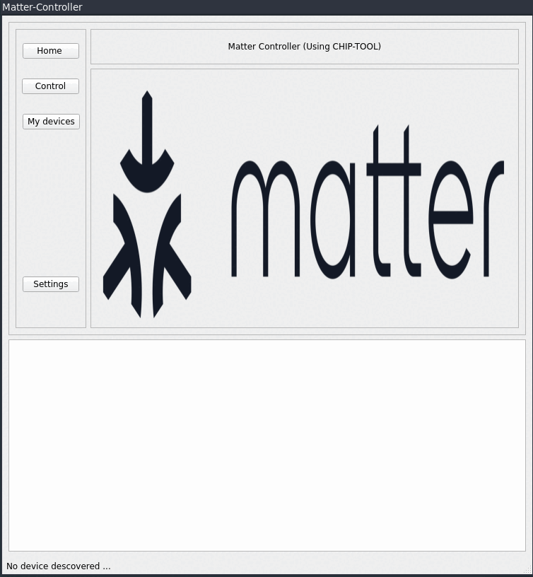

# Matter Controller 
Matter Controller a GUI application that controls and commissions matter devices 
its an interface that wraps over the `CHIP-TOOL` command  
- This is a testing version. 
- I tested in on `matter-linux-lighting-app example`.
- Only suppots the lighting app for now.  
## Matter controller application

### Scripts folder 
contains 2 scripts: 
- one to launch qt-designer 
- the other to compile `.ui` files. 
