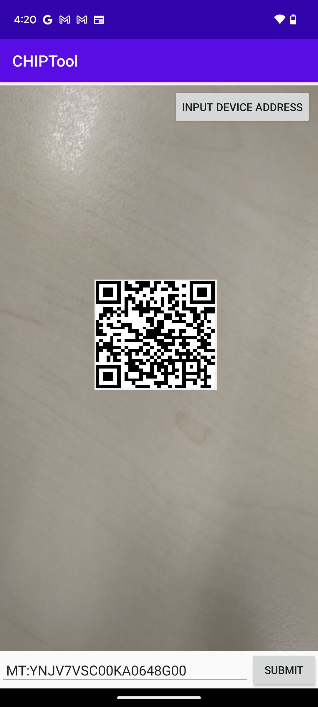
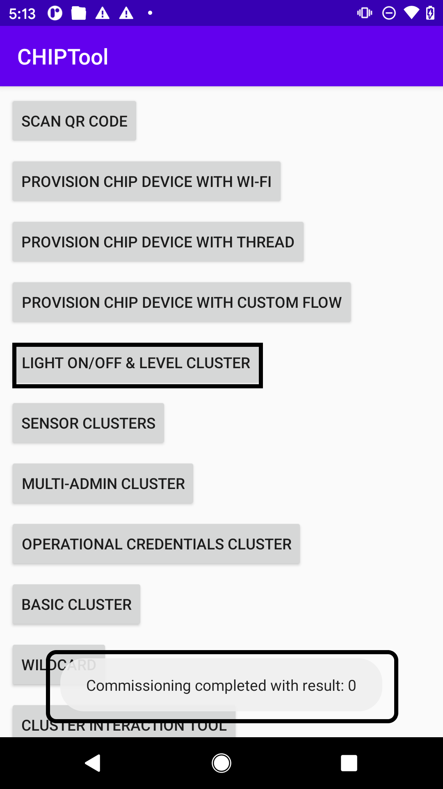
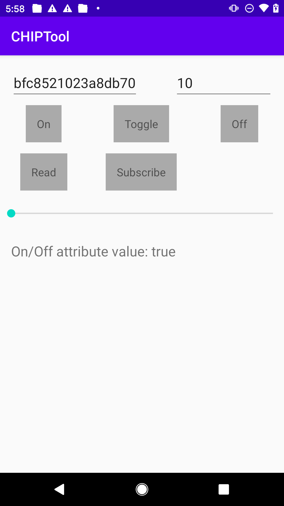

## Commissioning methods supported by matter  
### 1- BLE commissioning 
### 2- OnNetwork commissioning 
Both the controller and the accessory are already on the same network (e.g., Wi-Fi).
The accessory advertises its presence on the network, and the controller can discover and commission it over the same network.
### 3- SoftAP (Software Access Point) Commissioning
The accessory creates a temporary Wi-Fi access point. The controller connects to this access point to perform commissioning and then switches to the main network.
### Out-of-Band (OOB) Commissioning
Uses a secondary channel (e.g., QR codes, NFC, or manual entry) to exchange commissioning information securely.
## ChipTool-App 
Note: The device running Android CHIPTool app, should be connected to the same AP _**(configured [here](https://github.com/MicrochipTech/PIC32MZW1_Matter_Project#building-the-example))**_

#### Step 1:

Connect your samrtphone to the target AP that the Matter device need to be connected to. Enable Bluetooth in the setting page of your smartphone.

#### Step 2:

Use "PROVISION CHIP DEVICE WITH WI-FI" -> "INPUT DEVICE ADDRESS" tabs to start commissioning WFI32-IoT board with IP address.

#### Step 3:

Scan the on-board payload QR code

#### Step 4:

Input the target AP SSID and password, click **SAVE NETWORK**

#### Step 5:

CHIPTool app notifies successful commissioning of Matter device with message "Commissioning completed with result: 0". To proceed with controlling device, use "LIGHT ON/OFF & LEVEL CLUSTER" tab.

#### Step 6:

The Yellow LED on-board can be controlled - turned ON, OFF, toggled using respective tabs. The "READ" tab returns the On/Off command value.

User can also press SW2 on-board to control ON, OFF the Yellow LED locally. The "READ" tab on the APP returns the On/Off command value.

- Note: "Fabric ID" and "Device ID" fields will be auto populated.

