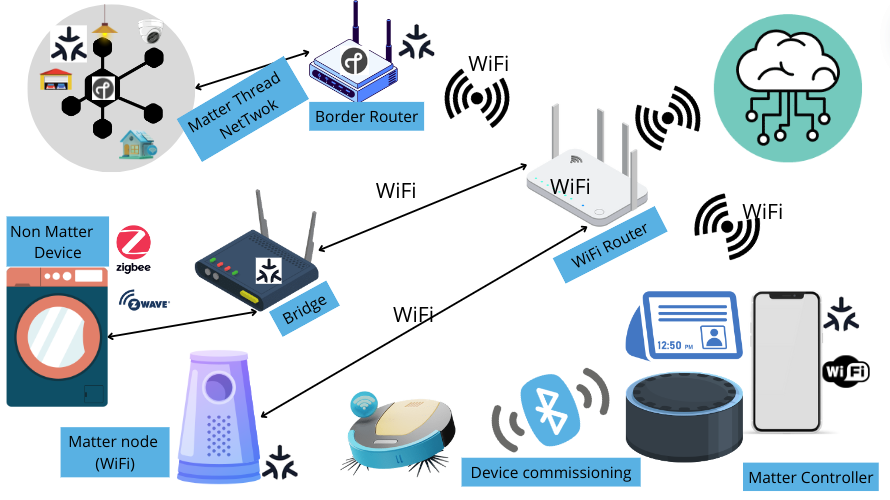
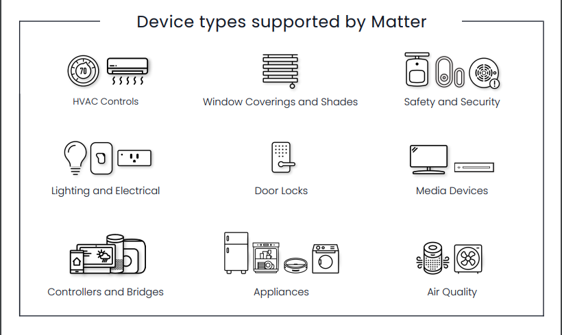
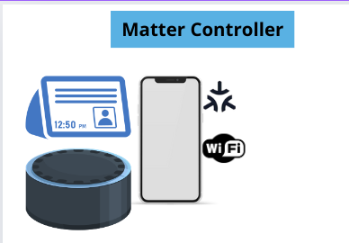

Objective:
Create a Linux application that performs the matter controller (Qt application, or python ....).
[Matter-handbool](https://handbook.buildwithmatter.com/)
# Matter 
## Introduction 

Matter is a freely available connectivity standard for smart home and IoT devices. 
IT improves interoperability and compatibility between different manufacturer and security, and always allowing local control as an option. 

## Matter runs on: 
- Threads
- Wi-Fi 
- Ethernet
- Bluetooth low energy for commissioning
##### Note: 

The commissioning profile is an example of a proprietary profile that can be used to add nodes to a network using Bluetooth (BLE) 
The commissioning profile is used to transfer settings from a BLE central (smartphone) to a BLE peripheral (a leaf node)that is to be added to network
The BLE central is used as a trusted third party between the BLE peripheral and the router. 

## Matter network architecture : 

							-- Explain the image -- 

## Device types supported by matter: 

## Matter Controller

Controllers are responsible for controlling Matter devices in a smart Home. 

It's the brain of the system 

Controller functionality can be built into many devices, it's possible to have many controllers 

(example: Amazon echo and nested Hub) 

A matter controller could also be a smartphone app 
#### What does a controller do: 

- Control a Matter device by sending commands.
- Receive Data from matter devices.
- Device commissioning via Bluetooth.
- Perform Over the air updates ( add a way to perform update the software on the controller).
- Controller logic: Voice assistant or a dashboard.
## Matter terms in a nutshell

### Matter Administrator

Every _Matter_ installation has privileges and security certificates that need to be managed. This task is performed by a device or software with the Administrator role. It can be integrated into hardware products such as a hub, but apps can also be used as administrators.

### Matter Bridge

A bridge translates protocols that _Matter_ does not natively support (such as Zigbee or Z-Wave) into the language of the standard. This means that incompatible devices can still be connected to a _Matter_ fabric and integrated into the control system.

### Matter Commissioner
Commissioners are devices or software programs (apps) that set up _Matter_ devices. In doing so, they provide them with login information for the network and assign them to a _Matter_ Fabric. The commissioner role can also be integrated into tools with other tasks, such as _Matter_ Controllers.

### Matter Controller
Controllers are used to operate installed devices. Their task is not tied to a specific type of device. They can be integrated into stationary smart home hubs, telephones and even networked switches. Apps are also possible.

### Matter Device

Hardware products that support the _Matter_ standard are considered (end)devices. They can be set up by a commissioner and can then be controlled by _Matter_ controllers in the fabric. Typical representatives of this category are lamps, switches, sensors, thermostats, door locks and also bridges.
### Matter Fabric

During installation, devices join a _Matter_ Fabric. This virtual network is private and can extend across various physical networks in the building – Wi-Fi, Ethernet and Thread. It forms the basis for secure communication between devices, controllers and administrators.

### Matter Bridge  or Hub

A Matter bridge connects non-_Matter_ devices to a Matter network. It allows these devices to be controlled and interact with _Matter_-compatible devices and controllers.
Non matter device could be: 
- Zigbee 
- Z-wave 
### Matter border Router

The primary function of a Thread Border Router is to move data between the Thread mesh network and the home network (Wi-Fi, Ethernet) 
#### Thread: 
Thread is a low-power, wireless mesh networking protocol, it is an IP and mesh based protocol. 

## Matter stack:
### Matter application
Business logic: turning lamp On/Off, dimming light .... 
### Data model see [[Matter-data-model]] 
Describes supported operations. Uses the concept of clusters. 
### interaction model
Describes what interactions can be performed by a client on a server(Read Write, 
invoke ( send commands that changes more than attributes: toggle lamp  ), subscribe : subscribe to a service ( like subscribing to a temp service , not Reading each time the temp value ))
### Action Framing
Serializes the interactions and creates a binary format (frame)
TLV: type length format
This stage is responsible for coding the data to be transferred in TLV format, then creates a binary format.
### Security 
Encrypts the frame and append a (MIC: message integrity code)
### Message framing & routing: 
Generates the generic matter frame format with routing and security information
Then it is transferred directly with TCP 
### MRP: message Reliability protocol - UDP 
Guaranties reliable delivery of UDP packets 

### BTP: Bluetooth transport protocol - BLE
Used for commissioning via BLE.

## Matter installation and setup
[[Matter Installation]]

## Configuring Matter controller on a raspberry PI:
[[Matter device on a raspberry pi]]

# Bibliography: 
[what is a matter controller](https://matter-smarthome.de/en/know-how/what-is-a-matter-controller/)
[matter-smart-home](https://www.theverge.com/23390726/matter-smart-home-faq-questions-answers)
[How to setup matter on Raspberry pi ](https://mattercoder.com/codelabs/how-to-install-matter-on-rpi/?index=..%2F..index#5)
[matter Coder](https://mattercoder.com/)
[understanding matter](https://www.youtube.com/watch?v=dv6K5cVImtY)
