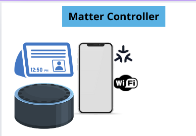

# Objective

**Create a matter controller**  
Create an application on Linux (Qt cpp, python), that play the role of a matter controller: 
- Controls the devices that are locally connected over WiFi. 
- Performs device Bluetooth  commissioning.  

# Steps: 
## 1- Research about matter:
This step is all about Researching and documentation and collecting useful resources (General) 
- [x] Understand what is the matter Architecture 
- [x] understand what is a matter controller 
- [ ] Trying to understand the matter stack :
	- [ ] Create a matter device on a raspberry pi. 
	- [ ] how matter sends and  receives data 
	- [x] Clusters and communication
	- [ ] Download the matter SDK and test the switch example. 
	- [ ] create in Canva a simple representation/diagram how would the system works 
- [ ] Understand the commissioning process
- [ ] Understand how the developed application would work 

## 2- Requirement process:
Understand what is project requirement: what the application needs to do. 
Then Search for the best tools to create the app ( Qt cpp , python, C ...)
Setup the environment and do a little testing for matter   

## 3- application Design :
Create an application Design and layout 
Create a software design 
## 4- Programming:
Program the application 